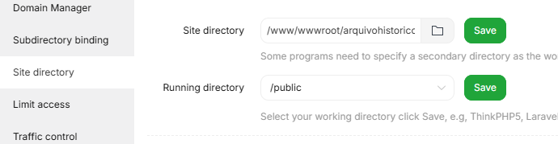
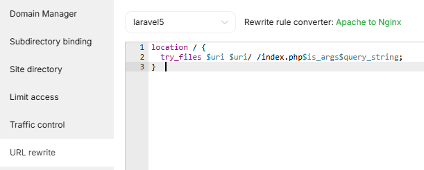

## INSTALANDO O PROJETO NO AAPANEL COM NGINX

### 1 Clone o projeto do Github

Acesse seu servidor via SSH e clone o projeto

``` 
git clone https://github.com/1802450038/arquivo-historico.git
``` 

### 2 Definir permissões

Após o clone, na mesma pasta ainda defina as permissões dos arquivos.

No AAPANEL o user padrão dos apps e do servidor é o www. Então voce deve adicionar ele ao grupo de administrador junto do seu usario logado que utiliza para o acesso ssh eg. o seu user tecnico.

``` 
sudo usermod -a -G www tecnico
``` 


``` 
sudo chown -R tecnico:www arquivo-historico
``` 


``` 
sudo find arquivo-historico -type d -exec chmod 775 {} \;
``` 


``` 
sudo find arquivo-historico -type f -exec chmod 664 {} \;
``` 

### 3 Instalando dependencias

Instale as dependencias do composer

<muted> (Usamos --no-dev -o por ser um ambiente de produção).</muted>


``` 
composer install --no-dev -o
```

### Rode os comandos default

``` 
php artisan key:generate
``` 

``` 
php artisan migrate
``` 

``` 
php artisan make:filament-user
``` 

``` 
php artisan storage:link
``` 

``` 
php artisan optimize:clear
``` 

## Ajustando o nginx

No aapanel navegue até website selecione o site em site directory aponte a pasta do projeto. E em running directory aposte para a pasta /public



Em url rewrite selecione laravel5



## Publicando assets

No nginx vode deve publicar os assets das views pois o mesmo não encontra por padrão. Ou seja, toda alteração que fizer no projeto deve executar os seguintes comandos.

```
php artisan vendor:publish --tag=livewire:assets --force
```

``` 
php artisan optimize:clear
``` 